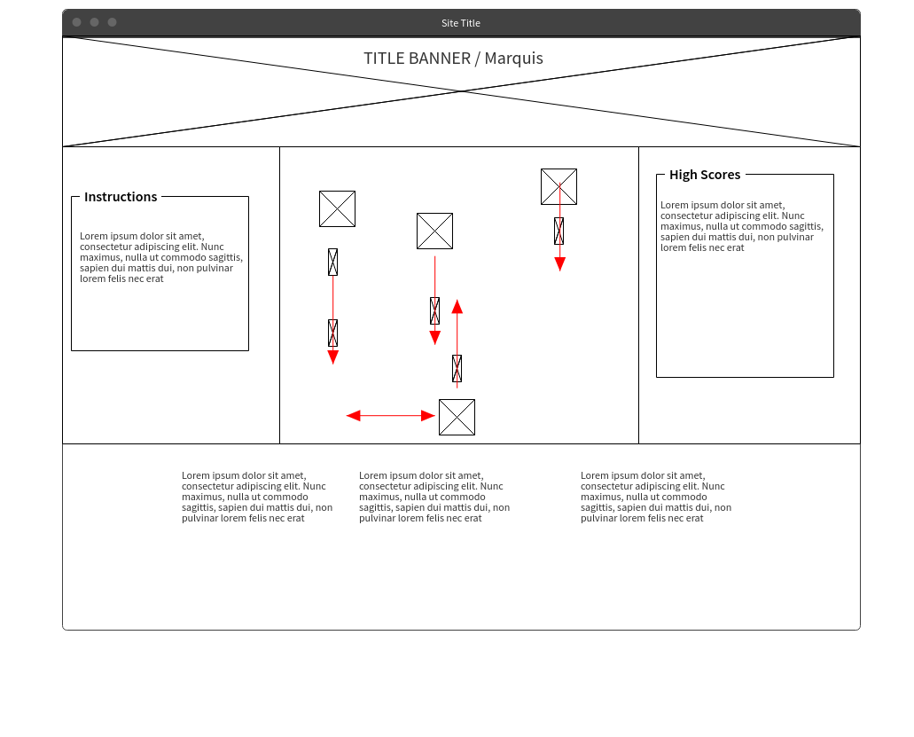

# p-1

## A top-down arcade-style shoot'em up game


try it here: https://p1-arcade.herokuapp.com/

### Inspiration
This game was inspiration by my favorite [vertically scrolling](https://en.wikipedia.org/wiki/Vertically_scrolling_video_game) arcade shooters such as [Galaga](https://en.wikipedia.org/wiki/Galaga), [Space Invaders](https://en.wikipedia.org/wiki/Space_Invaders), [Yars Revenge](https://en.wikipedia.org/wiki/Yars%27_Revenge), [Sky Shark](https://en.wikipedia.org/wiki/Flying_Shark), and [1943](https://en.wikipedia.org/wiki/1943:_The_Battle_of_Midway).

### Tools
* Wireframes - a rough initial layout for the page
* Agile & [Trello](https://trello.com/b/wyGnPLBF/project-1) - the agile development used alongside a trello helps efficiency and organization
* [p5.js](https://p5js.org/) - a javascript library for manipulating HTML5's `canvas`
* [p5.play.js](http://p5play.molleindustria.org/) - an additional library for p5 writtens specifically for game creation
* Vanilla JS DOM manipulation - For handling everything outside of the canvas

### p5.js overview
p5 and p5.play provide many useful functions that made the development of this game much easier.
The core functionality of p5's canvas manipulation rests in two functions: `setup()` and `draw()`
* `setup()` is executed when the page loads so it is useful for performing all initialization tasks such as creating the canvas, drawing the initial sprites, and initializing the player's data (score, lives, and initial location)
* `draw()` is executed every frame. Here we can listen for user inputs and redraw all the sprites as their position vectors change
Using *p5.play* on top of *p5* provides the benefit of built-in collision detection and simplified sprite creation.
With *p5*, you would first have to create a constructor function for every type of object that would appear on the screen. Then you would create an instance within `setup()` and finally call the the method of your object which draws it to the screen in the `draw()` function.
For a pong game this would look like this:
```javascript
  let ball;
  let paddle;
  
  setup(){
    ball = new Ball(init_x, init_y, width, height);
    paddle = new Paddle(init_x, init_y, width, height);
  }
  draw(){
    ball.draw();
    paddle.draw();
  }
```
However, *p5.play* provides the `createSprite(x,y,h,w)` and `drawSprites()` methods which allows us to quickly create and draw sprites.
```javascript
  setup(){
    ball = createSprite(init_x, init_y, width, height);
    paddle = createSprite(init_x, init_y, width, height);
  }
  draw(){
    drawSprites();
    }
```
`createSprite()` automatically creates a sprite object with the given size and position and comes preloaded with methods and properties for handling velocity and collision.

Although it may not be clear at first that `drawSprites()` is valuable, it quickly becomes clear when you are trying to draw hundreds of sprites to the canvas every frame.

Perhaps the largest benefit of *p5.play* is its `.collision()` method in the Sprite class. A long collision detection algorithm of if statements becomes a single line.
```javascript
checkCollision(paddle_position, paddle_height, paddle_width){
		if (this.position.x <= 0 || this.position.x >= (width - this.width)){
			this.velocity.x *= -1;
		} 
		if (this.position.y <= 0 || this.position.y >= (height - this.height)) {
			this.velocity.y *= -1;
		} 
		// check if ball is less than paddles x position && within paddles height space
		if (this.position.x <= (paddle_position.x + paddle_width)){
			if (this.position.y <= (paddle_position.y + paddle_height)){
				if (this.position.y >= paddle_position.y){
					this.velocity.x *= -1;
				}
			}
		}
	}
  
  // ---- OR WITH p5.play.js ---- //
  
  ball.collision(walls, callback);
  
  function callback(ball, wall){ /*DO STUFF*/}

```

In this game, I used *p5.play*'s createSprite() method to create enemies, projectiles and the player.

The only limitation I found with *p5.play* was that I could not create new sprite subclasses as follow:
```javascript
class player extends Sprite {
  constructor(pos_X, pos_Y, height, width){
    super(pos_X, pos_Y, height, width);
    // player specific properties and methods
  }
}
```

However, I was still able to add properties to instances of the sprites: 
```javascript
let enemy =  createSprite(x,y,h,w);
enemy.health = 3;
```

### Overview of the DOM Manipulation
I used vanilla JS DOM manipulation to handle the start of the game and the score board.
For the game start, I just added a button that the player can click to show the canvas and start the game.

For the high scores, I store a list of all scores in the browser’s memory and dynamically create a table containing the ordered list of scores every time the player's score changes. This allows the player to see their score in relation to all previous scores in real time.

If I had more resources, I would host the scores on a remote server so that the players could compete against all player everywhere.

### Wireframes
Here are the initial wireframe designs.
Deviations from the original design were to improve the user experience.



### Challenges / Issues
#### Managing workflow
* Feature Overlap: My initial user stories had overlapping features or I did not plan to complete them in the correct order. This caused some disorganization in my work flow. A lot of the work was done already by the time I got to the later features. In future projects I will spend more time separating my features out to be sure there is no overlap and order them in a way that prevents jumping around.
* Stretch Goals: I underestimated the amount of time it would take to develop the minimum featureset and I did not plan the stretch goals very effectively. My stretch goals were vague and did not have points assigned. I spent a lot of time just tweaking design an reorganizing code instead of pursuing a large flex feature.

#### Documentation
I found using the p5 and p5.play libraries to be mostly intuitive and the documentation for p5 to be thorough. However the documentation for p5.play felt lacking in many areas. There were several occasions where I was not sure what a method or property did. To fill these gaps, I used a great user-created guide that walks through live examples of many of the p5.play functions. The guide can be found here: http://creative-coding.decontextualize.com/making-games-with-p5-play/

#### p5 and GH-Pages vs Heroku
* loading local images: p5 uses a `preload()` function to load all the necessary images and animations before drawing the canvas. When I used this function, I saw an "cross-origin" console error that links to [this page](https://github.com/processing/p5.js/wiki/Local-server) which gives a short explanation of why you recieved the error and some options for fixing it. In short, a local server is required to load local images.
* local images on github pages: the same problem exists when trying to load the game from gh-pages. To get a live, playable game, I had to push the app to a Heroku server instead. This was a fairly strait forward process once I found a short guide to pushing static sites to heroku ([found here](https://medium.com/shovel-apps/simple-node-js-server-on-heroku-210ec24f485)). The site would not build after following the steps because it leaves out adding `"start": "node index.js"` to `scripts` in `package.json`. Everything built and deployed perfectly after this was corrected.

#### Live Scoreboard
Adding a scoreboard that updates each time the user scores points was a fun challenge that I had not fully anticipated. I was keeping track of the the current players score within the canvas but I had to come up with a way to show it outside the canvas and have the current players score move up the board of past scores in real time.
I am aware of the concept of data binding where when the data changes, so does the view to represent the new data. I decided to simulate this effect with basic javascript event listeners.
How it works: 
* when the user loads the page, the history of previous player scores is loaded from local browser storage and displayed in order on the scoreboard
* when the user scores their first point, their name is added at the bottom of the score board. Every time they score, their score is updated in the list and the list is reordered before being re-rendered on the page.
* The local storage is also overwritten with every score change so if the user closes or refreshes the page at any time, their score will still be saved

#### Layout and Design
I struggled to make a visually appealing layout (outside the game area) from my initial wireframe. Thankfully I was able to get valuable feedback from many people on ways to improve the design and usability.

#### Usability iteration
* Controls: Initially I reserved the `a` and `d` keys for player movement and displayed instructions telling the player to use these keys. However, I noticed that 9 times out of 10 times, a new user would not see the instructions and reach for the left and right arrow keys. I tried changing the placement and design of the instructions but users would still try to use the arrow keys. In the end I gave the player to use the arrow keys or a and d.
* Background: I also received feedback that the scrolling background was confusing. I intended it give the game a sense of motion (like in galaga) but some players thought the stars in the background were objects to be avoided. I have tried various adjustments to the speed and brightness of the stars to alleviate this confusion but I don't think I have found the final solution.

### What’s left to be done
* Be able to generate any amount of enemies on the screen at a time
* Increase the difficulty as the levels advance (enemies are stronger / faster)
* Boss battles
* Sound effects / music
* Artwork - custom and more diverse
* Score DB - save scores remotely instead of in the browser

### Credits:
Game artwork is royalty free from https://opengameart.org/
